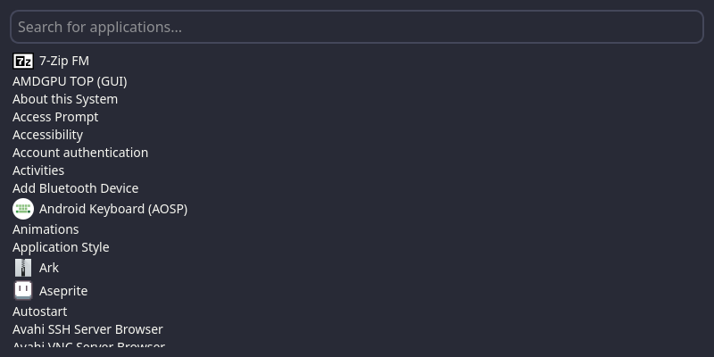

# Pyauncher

A simple and lightweight application launcher for Linux desktops.



## Features

*   **Instant Search:** Find applications as you type.
*   **Keyboard Navigation:** Navigate the application list with arrow keys.
*   **Launch with Enter:** Press Enter to launch the selected application.
*   **Top of the Screen:** Appears at the top of the screen for easy access.
*   **Modern Look:** Rounded corners and a clean, dark theme.
*   **Lightweight:** Minimal dependencies and resource usage.

## Getting Started

These instructions will get you a copy of the project up and running on your local machine for development and testing purposes.

### Prerequisites

*   Python 3
*   pip

### Installation

1.  **Clone the repository:**
    ```bash
    git clone https://github.com/krasseboehmer/pyauncher.git
    cd pyauncher
    ```

2.  **Create a virtual environment:**
    ```bash
    python3 -m venv venv
    ```

3.  **Activate the virtual environment:**
    ```bash
    source venv/bin/activate
    ```

4.  **Install the dependencies:**
    ```bash
    pip install -r requirements.txt
    ```

## Usage

To run the application, use the following command:

```bash
source venv/bin/activate && python3 main.py
```

You can also create a desktop shortcut or a keybinding in your display manager to launch the application more easily.

## Contributing

Contributions are welcome! Please feel free to submit a pull request.

1.  Fork the Project
2.  Create your Feature Branch (`git checkout -b feature/AmazingFeature`)
3.  Commit your Changes (`git commit -m 'Add some AmazingFeature'`)
4.  Push to the Branch (`git push origin feature/AmazingFeature`)
5.  Open a Pull Request

## License

Distributed under the MIT License. See `LICENSE` for more information.
